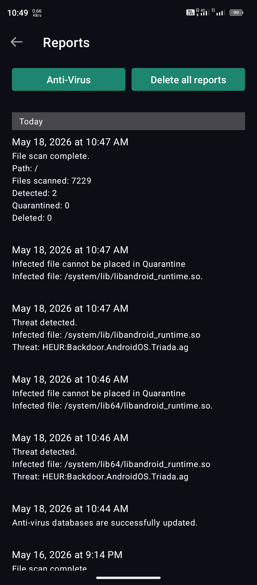
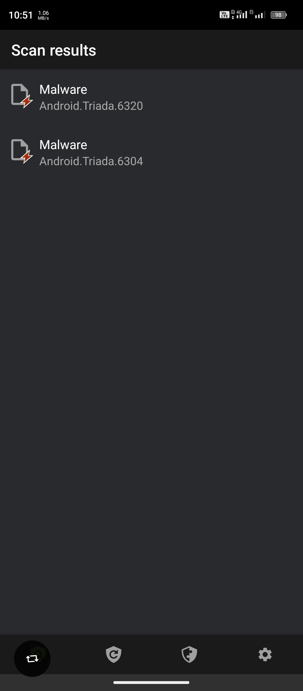

# Antivirus Detection Evidence

This document records antivirus scan evidence supplied for the INOI A75 Elegance device and correlates it with the firmware files analyzed in this repository.

The screenshots are evidence from an already booted device scan. The code and hash evidence in this repository comes from static firmware analysis. Together, they support the same conclusion: both 32-bit and 64-bit `libandroid_runtime.so` system libraries are suspicious and contain staged Android backdoor behavior.

## Screenshot Evidence

### Kaspersky

Screenshot file:

- [Screenshot_20260518-104926.png](../evidence/av_scans/screenshots/Screenshot_20260518-104926.png)
- SHA256: `ab4cb7159bd5f9ad6c252f743ef4e67186fb36fe4eec06c092beb8d2ed9d7a7a`
- Image format: PNG, 1080 x 2460

Observed Kaspersky findings from the screenshot:

- scan path: `/`
- files scanned: `7229`
- detected: `2`
- quarantined: `0`
- deleted: `0`
- detection: `HEUR:Backdoor.AndroidOS.Triada.ag`
- infected file: `/system/lib/libandroid_runtime.so`
- infected file: `/system/lib64/libandroid_runtime.so`
- Kaspersky reports both infected files could not be placed in quarantine.

### Dr.Web

Screenshot file:

- [Screenshot_20260518-105148.png](../evidence/av_scans/screenshots/Screenshot_20260518-105148.png)
- SHA256: `8dbf465c2b81d48647ccea0fb20a3e40646374d472a5f26e3ad8ab18549e724b`
- Image format: PNG, 1080 x 2460

Observed Dr.Web findings from the screenshot:

- detection: `Android.Triada.6320`
- detection: `Android.Triada.6304`

The Dr.Web screenshot shows the malware family names but not the full file paths in the visible area. The file path mapping below comes from the device scan report provided by the device owner:

- `Android.Triada.6320`: `/system/lib64/libandroid_runtime.so`
- `Android.Triada.6304`: `/system/lib/libandroid_runtime.so`

## Firmware File Correlation

The same two system libraries were extracted from the firmware backup and analyzed statically.

| Firmware path | SHA256 | Related analysis |
| --- | --- | --- |
| `/system/lib/libandroid_runtime.so` | `1a2a9ea70915532453d30f3a211585e4bb8c5e0f667caa230591a2de7170ba5c` | [libandroid_runtime.so Analysis](05-libandroid-runtime-analysis.md) |
| `/system/lib64/libandroid_runtime.so` | `0a009598815a0d83767ef9d5954f7653bbbed5a0f8e6d91d046dcd0b89fa57cd` | [libandroid_runtime.so Analysis](05-libandroid-runtime-analysis.md) |

Static analysis of these libraries found embedded ZIP/DEX payloads and staged Android loader behavior. The decompiled payload evidence is stored in [Selected Decompiled JADX Source Evidence](../evidence/jadx_sources/README.md).

## Why This Strengthens The Finding

The antivirus evidence and static code evidence point at the same files:

1. Kaspersky flags `/system/lib/libandroid_runtime.so` and `/system/lib64/libandroid_runtime.so` as `HEUR:Backdoor.AndroidOS.Triada.ag`.
2. Dr.Web flags Triada-family detections on the same reported library pair.
3. Static extraction from the firmware finds embedded DEX/JAR payload logic inside these libraries.
4. JADX analysis confirms staged loading, package install/uninstall capability, encrypted network communication, device/SIM profiling, and remote payload execution capability.

The most important supporting documents are:

- [libandroid_runtime.so Analysis](05-libandroid-runtime-analysis.md)
- [JADX Malware Code Analysis](06-jadx-malware-code-analysis.md)
- [Malware Execution Flow](08-malware-execution-flow.md)
- [Decoded network and action strings](../evidence/jadx_malware_code/decoded-network-and-action-strings.md)
- [High-risk code locations](../evidence/jadx_malware_code/high-risk-code-locations.md)

## Careful Wording

This evidence is strong enough to document that the firmware contains dangerous Triada-style code paths in core system libraries.

This document does not prove who inserted the code. Attribution to manufacturer, factory, reseller, OTA provider, repair channel, or another party requires supply-chain evidence outside the firmware sample itself.
